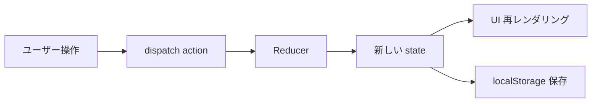

# 技術仕様書

## テクノロジースタック

### フロントエンド

| カテゴリ | 技術 | バージョン | 用途 |
|---------|------|-----------|------|
| 言語 | TypeScript | 5.x | 型安全な開発 |
| UIライブラリ | React | 19.x | コンポーネントベースUI |
| ビルドツール | Vite | 6.x | 高速な開発サーバーとビルド |
| CSSフレームワーク | Tailwind CSS | 4.x | ユーティリティファーストCSS |
| ユーティリティ | uuid | 11.x | UUID生成 |
| ユーティリティ | date-fns | 4.x | 日付操作 |

### 開発ツール

| ツール | 用途 |
|--------|------|
| ESLint | コード品質チェック |
| TypeScript Compiler | 型チェック |
| npm | パッケージ管理 |

## 技術的制約と要件

### フロントエンドのみ
- バックエンドサーバーは使用しない
- データは localStorage で永続化
- 将来的にAPI連携する場合はContext層で抽象化

### ブラウザ対応
- Chrome 100+
- Firefox 100+
- Safari 16+
- Edge 100+

### パフォーマンス要件
- 初期ロード: 2秒以内
- タスク操作: 100ms以内のレスポンス
- 100件のタスクでスムーズに動作

## 状態管理

### React Context API
- `TaskContext` でアプリ全体のタスク状態を管理
- `useReducer` でタスクの追加・更新・削除を制御
- localStorage との同期は Context 内で自動処理

### 状態フロー

