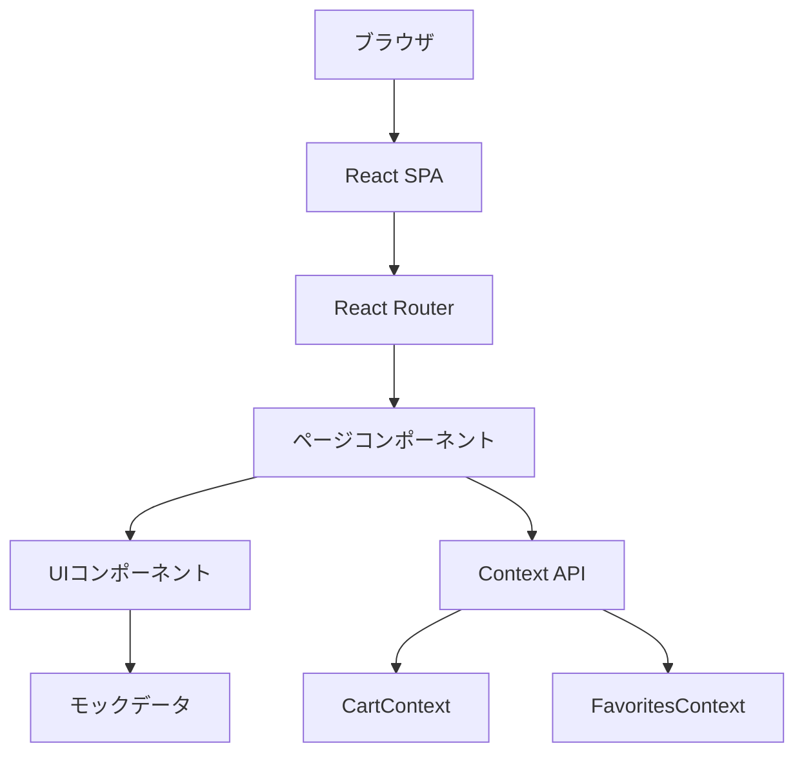
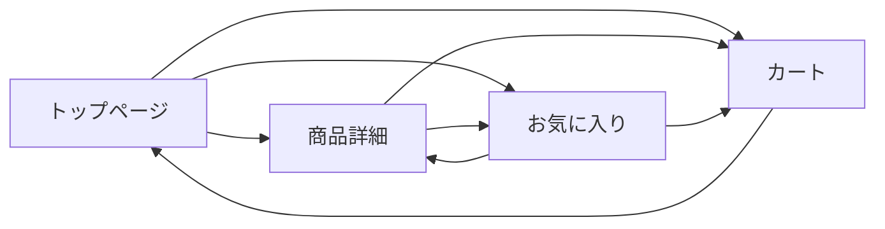

# 機能設計書

## 1. システム構成図



## 2. 画面遷移図



## 3. 画面一覧

| 画面名 | パス | 説明 |
|--------|------|------|
| トップ（商品一覧） | / | 商品一覧を表示 |
| 商品詳細 | /products/:id | 商品詳細を表示 |
| カート | /cart | カート内商品を表示 |
| お気に入り | /favorites | お気に入り商品を表示 |

## 4. コンポーネント設計

### 4.1 レイアウトコンポーネント

```
Header
├── ロゴ（トップへのリンク）
├── ナビゲーション
│   ├── カートアイコン（商品数バッジ）
│   └── お気に入りアイコン
└── カテゴリフィルター

Footer
└── コピーライト
```

### 4.2 商品コンポーネント

```
ProductCard
├── 商品画像
├── 商品名
├── 価格
├── お気に入りボタン
└── カートに追加ボタン

ProductDetail
├── 商品画像（大）
├── 商品名
├── 価格
├── 説明文
├── 在庫状況
├── 数量選択
├── カートに追加ボタン
└── お気に入りボタン
```

### 4.3 カートコンポーネント

```
Cart
├── CartItem（繰り返し）
│   ├── 商品画像
│   ├── 商品名
│   ├── 単価
│   ├── 数量変更
│   ├── 小計
│   └── 削除ボタン
├── 合計金額
└── （購入ボタン - MVP後）
```

## 5. データモデル

### 5.1 Product（商品）

| フィールド | 型 | 説明 |
|------------|------|------|
| id | string | 商品ID |
| name | string | 商品名 |
| description | string | 説明 |
| price | number | 価格（税込） |
| image | string | 画像URL |
| category | string | カテゴリ |
| stock | number | 在庫数 |

### 5.2 CartItem（カート項目）

| フィールド | 型 | 説明 |
|------------|------|------|
| product | Product | 商品情報 |
| quantity | number | 数量 |

## 6. 状態管理

### 6.1 CartContext
- `items`: CartItem[] - カート内商品
- `addToCart(product, quantity)`: カートに追加
- `removeFromCart(productId)`: カートから削除
- `updateQuantity(productId, quantity)`: 数量更新
- `clearCart()`: カートをクリア
- `totalItems`: 合計商品数
- `totalPrice`: 合計金額

### 6.2 FavoritesContext
- `favorites`: Product[] - お気に入り商品
- `addToFavorites(product)`: お気に入りに追加
- `removeFromFavorites(productId)`: お気に入りから削除
- `isFavorite(productId)`: お気に入り判定

## 7. カテゴリ一覧

| カテゴリID | 表示名 |
|------------|--------|
| wagashi | 和菓子 |
| yogashi | 洋菓子 |
| seasoning | 調味料 |
| beverage | 飲料 |
| processed | 加工食品 |
