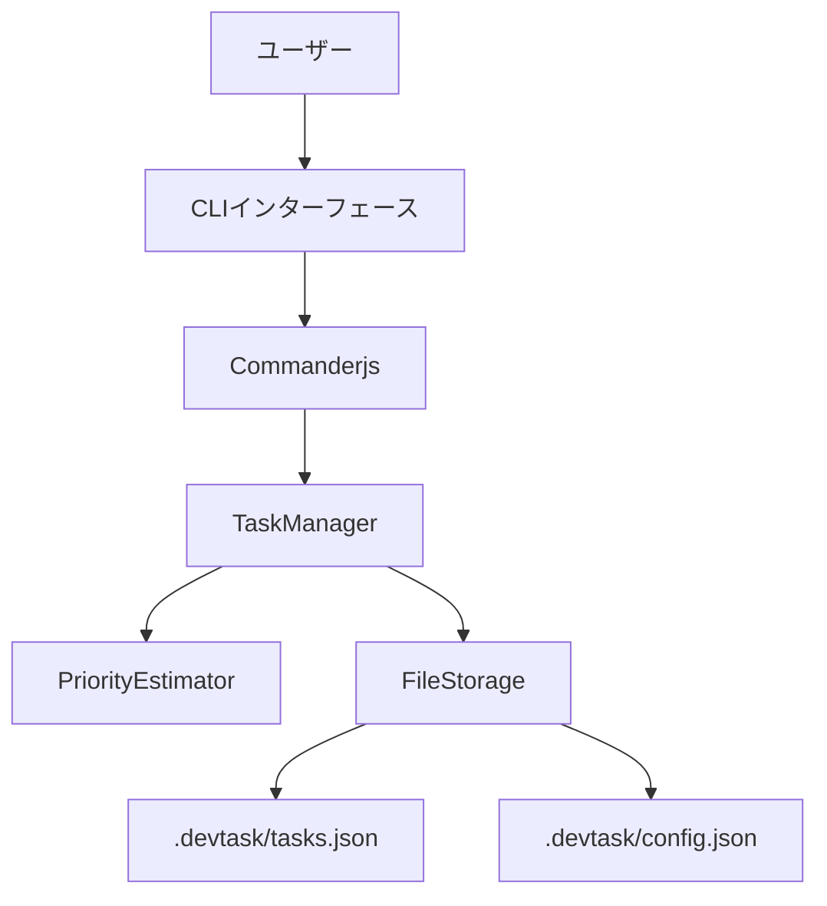
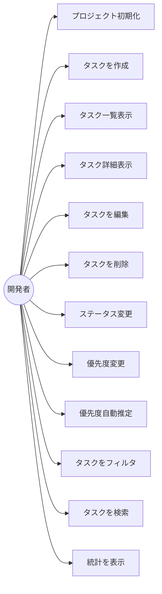
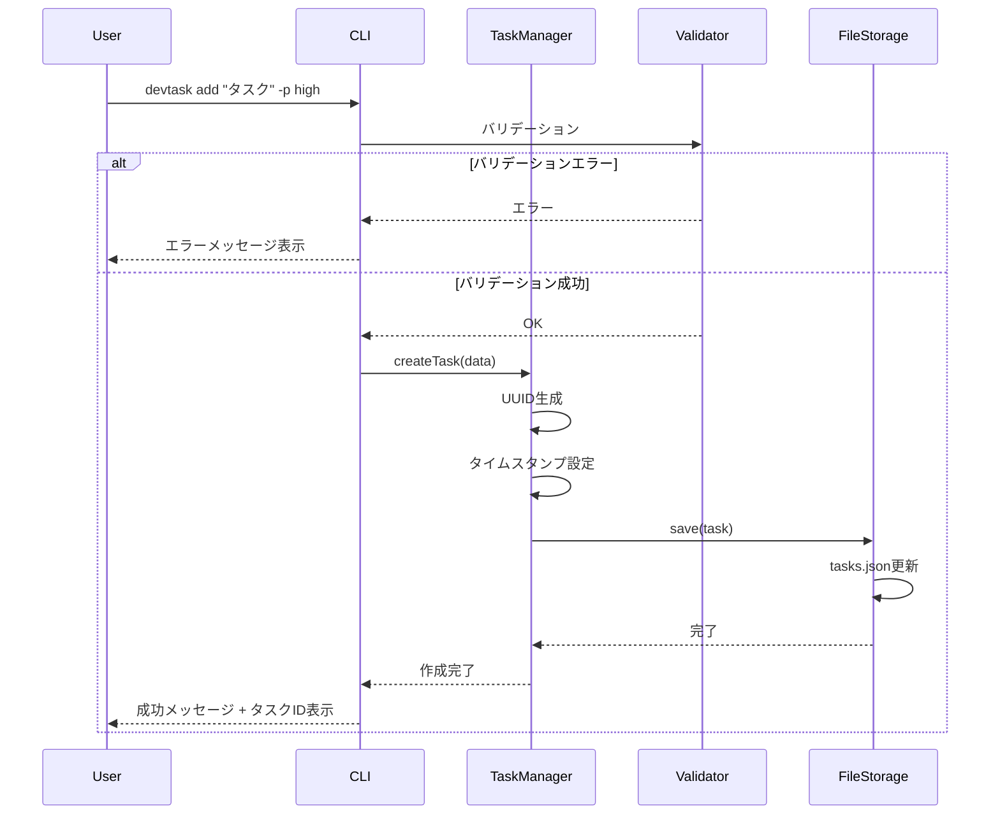
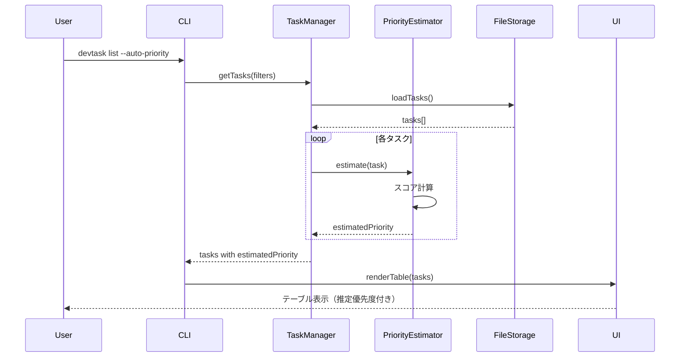
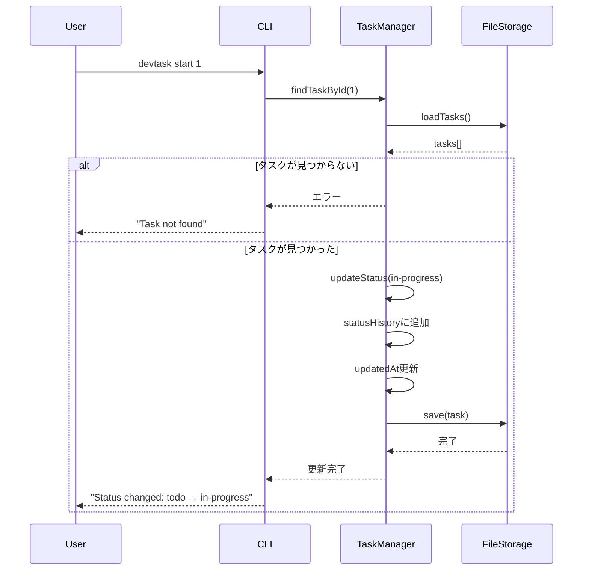

# 機能設計書 (Functional Design Document)

## システム構成図



## アーキテクチャ概要

### 技術スタック
- **Node.js 18.x以上** - 実行環境
- **TypeScript 5.x** - 型安全性
- **Commander.js** - CLIフレームワーク
- **Inquirer.js** - インタラクティブプロンプト
- **chalk** - ターミナルカラー出力
- **cli-table3** - テーブル表示
- **date-fns** - 日付操作
- **uuid** - タスクID生成

### アーキテクチャパターン

```
CLI Layer (Commander.js)
         ↓
Service Layer (TaskManager, PriorityEstimator)
         ↓
Data Layer (FileStorage)
         ↓
File System (.devtask/)
```

## データモデル定義

### Task型

```typescript
interface Task {
  id: string;                    // UUID v4
  title: string;                 // タスクのタイトル（必須、1～200文字）
  description: string;           // タスクの説明（任意、最大1000文字）
  status: TaskStatus;            // ステータス
  priority: TaskPriority;        // 優先度（手動設定）
  estimatedPriority?: TaskPriority;  // 推定優先度（自動計算）
  dueDate: string | null;        // 期限（ISO 8601形式、任意）
  createdAt: string;             // 作成日時（ISO 8601形式）
  updatedAt: string;             // 更新日時（ISO 8601形式）
  statusHistory: StatusChange[]; // ステータス変更履歴
}
```

### TaskStatus型

```typescript
type TaskStatus = 'todo' | 'in-progress' | 'done';
```

### TaskPriority型

```typescript
type TaskPriority = 'high' | 'medium' | 'low';
```

### StatusChange型

```typescript
interface StatusChange {
  from: TaskStatus;
  to: TaskStatus;
  changedAt: string;  // ISO 8601形式
}
```

### Config型

```typescript
interface Config {
  projectName: string;           // プロジェクト名
  version: string;               // Devtaskバージョン
  createdAt: string;             // プロジェクト初期化日時
  autoPriority: boolean;         // 自動優先度推定を有効化（デフォルト: false）
}
```

### FilterOptions型

```typescript
interface FilterOptions {
  status?: TaskStatus;
  priority?: TaskPriority;
  searchQuery?: string;
}
```

### TaskStats型

```typescript
interface TaskStats {
  total: number;                 // 総タスク数
  completed: number;             // 完了タスク数
  completionRate: number;        // 完了率（%）
  byStatus: {
    todo: number;
    inProgress: number;
    done: number;
  };
  byPriority: {
    high: number;
    medium: number;
    low: number;
  };
}
```

## コンポーネント設計

### アーキテクチャレイヤー

```
src/
├── cli/                        # CLIレイヤー
│   ├── index.ts               # CLIエントリーポイント
│   ├── commands/              # コマンド定義
│   │   ├── add.ts
│   │   ├── list.ts
│   │   ├── show.ts
│   │   ├── edit.ts
│   │   ├── delete.ts
│   │   ├── status.ts
│   │   ├── priority.ts
│   │   ├── stats.ts
│   │   └── init.ts
│   └── ui/                    # UI表示
│       ├── table.ts           # テーブル表示
│       ├── colors.ts          # カラー定義
│       └── prompts.ts         # インタラクティブプロンプト
├── services/                  # サービスレイヤー
│   ├── TaskManager.ts         # タスク管理ロジック
│   ├── PriorityEstimator.ts   # 優先度推定ロジック
│   └── FileStorage.ts         # ファイル操作
├── types/                     # 型定義
│   ├── task.ts
│   ├── config.ts
│   └── index.ts
├── utils/                     # ユーティリティ
│   ├── validation.ts
│   ├── dateFormat.ts
│   └── index.ts
└── constants/                 # 定数定義
    ├── taskStatus.ts
    ├── taskPriority.ts
    └── paths.ts
```

### 主要コンポーネント仕様

#### CLI Layer

**cli/index.ts**
- Commander.jsでCLI構築
- コマンド登録
- グローバルオプション（--version, --help）

**cli/commands/***
- 各コマンドの実装
- バリデーション
- エラーハンドリング
- 成功/失敗メッセージ

**cli/ui/table.ts**
- タスク一覧のテーブル表示
- カラーコーディング
- ボーダー・ヘッダー

**cli/ui/prompts.ts**
- インタラクティブ入力
- 選択肢表示
- デフォルト値

#### Service Layer

**services/TaskManager.ts**
- タスクのCRUD操作
- フィルタリング・検索
- ステータス変更
- 優先度変更
- 統計計算

**services/PriorityEstimator.ts**
- 優先度自動推定ロジック
- スコアリング計算
- 推定結果の返却

**services/FileStorage.ts**
- `.devtask/tasks.json` の読み書き
- `.devtask/config.json` の読み書き
- ファイルロック管理
- エラーハンドリング

## 優先度自動推定アルゴリズム

### スコアリングロジック

```typescript
interface PriorityScore {
  dueDateScore: number;      // 0-100
  ageScore: number;          // 0-100
  statusScore: number;       // 0-100
  totalScore: number;        // 0-100（加重平均）
  estimatedPriority: TaskPriority;
}
```

### 1. 期限スコア（dueDateScore）

```typescript
function calculateDueDateScore(task: Task): number {
  if (!task.dueDate) return 0;

  const now = new Date();
  const dueDate = new Date(task.dueDate);
  const daysUntilDue = differenceInDays(dueDate, now);

  if (daysUntilDue < 0) {
    // 期限切れ
    return 100;
  } else if (daysUntilDue <= 1) {
    // 1日以内
    return 90;
  } else if (daysUntilDue <= 3) {
    // 3日以内
    return 70;
  } else if (daysUntilDue <= 7) {
    // 1週間以内
    return 50;
  } else if (daysUntilDue <= 14) {
    // 2週間以内
    return 30;
  } else {
    // それ以上
    return 10;
  }
}
```

### 2. 経過時間スコア（ageScore）

```typescript
function calculateAgeScore(task: Task): number {
  const now = new Date();
  const createdAt = new Date(task.createdAt);
  const daysSinceCreated = differenceInDays(now, createdAt);

  if (daysSinceCreated >= 30) {
    // 1ヶ月以上
    return 80;
  } else if (daysSinceCreated >= 14) {
    // 2週間以上
    return 60;
  } else if (daysSinceCreated >= 7) {
    // 1週間以上
    return 40;
  } else if (daysSinceCreated >= 3) {
    // 3日以上
    return 20;
  } else {
    // それ未満
    return 0;
  }
}
```

### 3. ステータススコア（statusScore）

```typescript
function calculateStatusScore(task: Task): number {
  if (task.status === 'in-progress') {
    // 作業中のタスクは高優先度
    return 90;
  } else if (task.status === 'done') {
    // 完了済みは最低優先度
    return 0;
  } else {
    // 未着手
    // ステータス変更履歴を考慮
    const statusChangeCount = task.statusHistory.length;
    if (statusChangeCount > 0) {
      // 何度もステータスが変わっているタスクは優先度高め
      return Math.min(50 + statusChangeCount * 10, 100);
    }
    return 30;
  }
}
```

### 4. 総合スコア計算

```typescript
function calculateTotalScore(task: Task): PriorityScore {
  const dueDateScore = calculateDueDateScore(task);
  const ageScore = calculateAgeScore(task);
  const statusScore = calculateStatusScore(task);

  // 加重平均
  const weights = {
    dueDate: 0.5,    // 期限が最も重要
    age: 0.2,        // 経過時間
    status: 0.3,     // ステータス
  };

  const totalScore =
    dueDateScore * weights.dueDate +
    ageScore * weights.age +
    statusScore * weights.status;

  let estimatedPriority: TaskPriority;
  if (totalScore >= 70) {
    estimatedPriority = 'high';
  } else if (totalScore >= 40) {
    estimatedPriority = 'medium';
  } else {
    estimatedPriority = 'low';
  }

  return {
    dueDateScore,
    ageScore,
    statusScore,
    totalScore,
    estimatedPriority,
  };
}
```

## ユースケース図



## コマンドフロー図

### タスク作成フロー



### タスク一覧表示（優先度自動推定）フロー



### ステータス変更フロー



## UI設計

### テーブル表示例

```
┌────┬──────────────────────────┬──────────────┬──────────┬──────────┬────────────┐
│ ID │ Title                    │ Status       │ Priority │ Auto     │ Due Date   │
├────┼──────────────────────────┼──────────────┼──────────┼──────────┼────────────┤
│ 1  │ バグ修正                 │ in-progress  │ high     │ [A:high] │ 2025-01-05 │
│ 2  │ 機能追加                 │ todo         │ medium   │ [A:high] │ 2025-01-03 │
│ 3  │ リファクタリング         │ todo         │ low      │ [A:med]  │ -          │
└────┴──────────────────────────┴──────────────┴──────────┴──────────┴────────────┘

Total: 3 tasks | In Progress: 1 | Completed: 0/3 (0%)
```

### カラーコーディング

**ステータス:**
- `todo`: グレー（dim）
- `in-progress`: 青（cyan）
- `done`: 緑（green）

**優先度:**
- `high`: 赤（red）
- `medium`: 黄（yellow）
- `low`: 緑（green）

**自動推定優先度:**
- `[A:high]`: 赤背景（bgRed）
- `[A:med]`: 黄背景（bgYellow）
- `[A:low]`: 緑背景（bgGreen）

### インタラクティブモード例

```bash
$ devtask edit 1

? Task title: (バグ修正)
? Description: ログイン機能のバグを修正する
? Status: (Use arrow keys)
❯ todo
  in-progress
  done
? Priority: (Use arrow keys)
  high
❯ medium
  low
? Due date (YYYY-MM-DD): 2025-01-05

✓ Task updated successfully!
```

## データフロー

### ファイル構造

```
project-root/
└── .devtask/
    ├── config.json          # プロジェクト設定
    └── tasks.json           # タスクデータ
```

### config.json

```json
{
  "projectName": "My Project",
  "version": "1.0.0",
  "createdAt": "2025-01-01T00:00:00.000Z",
  "autoPriority": false
}
```

### tasks.json

```json
{
  "tasks": [
    {
      "id": "uuid-v4-string",
      "title": "バグ修正",
      "description": "ログイン機能のバグを修正",
      "status": "in-progress",
      "priority": "high",
      "estimatedPriority": "high",
      "dueDate": "2025-01-05T00:00:00.000Z",
      "createdAt": "2025-01-01T00:00:00.000Z",
      "updatedAt": "2025-01-02T00:00:00.000Z",
      "statusHistory": [
        {
          "from": "todo",
          "to": "in-progress",
          "changedAt": "2025-01-02T00:00:00.000Z"
        }
      ]
    }
  ]
}
```

## エラーハンドリング

### エラー種類

1. **バリデーションエラー**
   - タイトル未入力
   - 文字数超過
   - 不正な日付形式
   - 表示: 赤色でエラーメッセージ

2. **ファイルシステムエラー**
   - `.devtask/` ディレクトリが存在しない
   - 読み取り/書き込み権限エラー
   - JSONパースエラー
   - 表示: エラー詳細 + 解決方法の提示

3. **タスク未発見エラー**
   - 指定IDのタスクが存在しない
   - 表示: "Task not found: {id}"

4. **システムエラー**
   - 予期しないエラー
   - 表示: エラースタック + "Please report this issue"

### エラーメッセージ例

```bash
# バリデーションエラー
✗ Error: Task title is required (1-200 characters)

# プロジェクト未初期化
✗ Error: Not a Devtask project
  Run 'devtask init' to initialize a new project

# タスク未発見
✗ Error: Task not found: 999
  Run 'devtask list' to see all tasks
```

## パフォーマンス最適化

### 目標
- CLI起動時間: < 100ms
- コマンド実行時間: < 50ms
- 1000件のタスクでも快適動作

### 最適化手法

1. **遅延ロード**
   - 必要なモジュールのみロード
   - Dynamic import活用

2. **キャッシング**
   - タスクデータのメモリキャッシュ
   - 設定ファイルのキャッシュ

3. **効率的なフィルタリング**
   - Array.filterの最適化
   - 早期リターン

4. **並列処理**
   - 優先度推定の並列計算

## セキュリティ

### ファイルパーミッション
- `.devtask/` ディレクトリ: 755
- `tasks.json`, `config.json`: 644

### 入力バリデーション
- すべての入力値をバリデーション
- 特殊文字のエスケープ
- パスインジェクション対策

### コマンドインジェクション対策
- ユーザー入力を直接シェルコマンドに使用しない
- child_process.execを避け、execFileやspawnを使用

## 拡張性

### プラグインシステム（将来的）
- カスタムコマンド追加
- カスタム優先度推定ロジック
- カスタムUI出力

### Git連携（将来的）
- `.devtask/` をGitで管理（オプション）
- ブランチ名とタスクIDの紐付け
- コミットメッセージへのタスクID埋め込み
