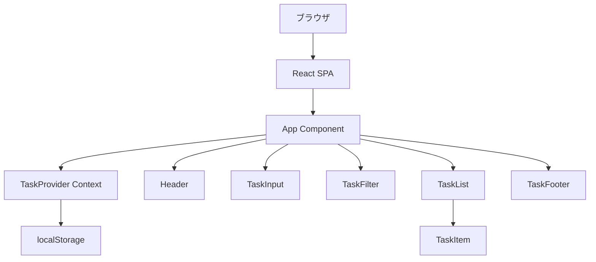
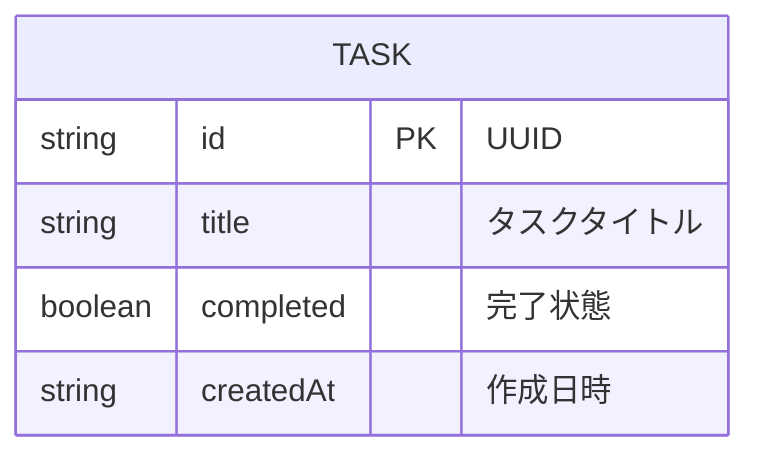
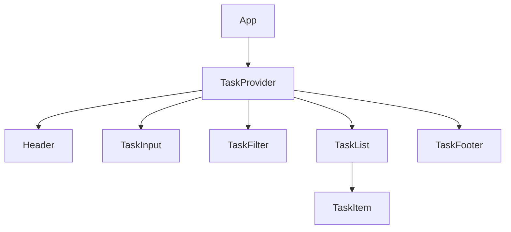
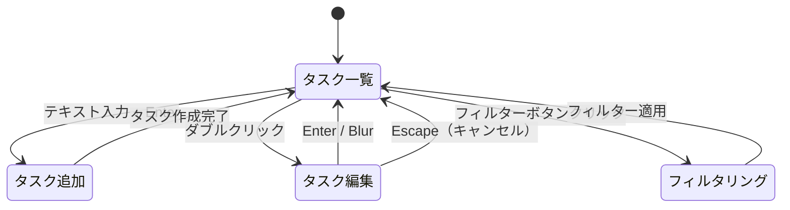
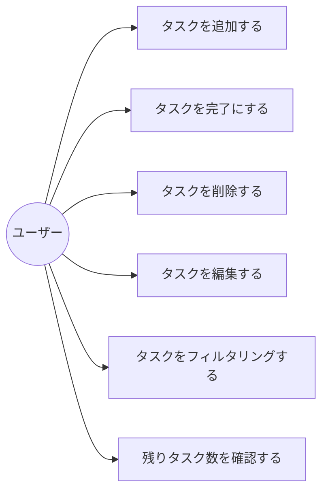

# 機能設計書

## システム構成図


```mermaid
graph TD
    A[ブラウザ] --> B[React SPA]
    B --> C[App Component]
    C --> D[TaskProvider Context]
    D --> E[localStorage]
    C --> F[Header]
    C --> G[TaskInput]
    C --> H[TaskFilter]
    C --> I[TaskList]
    I --> J[TaskItem]
    C --> K[TaskFooter]
```

## データモデル定義

### Task

| フィールド | 型 | 説明 |
|-----------|------|------|
| id | string (UUID) | タスクの一意識別子 |
| title | string | タスクのタイトル |
| completed | boolean | 完了状態 |
| createdAt | string (ISO 8601) | 作成日時 |

### FilterType

```typescript
type FilterType = 'all' | 'active' | 'completed';
```

### ER図


```mermaid
erDiagram
    TASK {
        string id PK "UUID"
        string title "タスクタイトル"
        boolean completed "完了状態"
        string createdAt "作成日時"
    }
```

## コンポーネント設計

### コンポーネントツリー


```mermaid
graph TD
    App --> TaskProvider
    TaskProvider --> Header
    TaskProvider --> TaskInput
    TaskProvider --> TaskFilter
    TaskProvider --> TaskList
    TaskList --> TaskItem
    TaskProvider --> TaskFooter
```

### コンポーネント一覧

| コンポーネント | 責務 |
|--------------|------|
| App | アプリケーションのルートコンポーネント |
| TaskProvider | タスクの状態管理とContext提供 |
| Header | アプリケーションのタイトル表示 |
| TaskInput | 新規タスクの入力フォーム |
| TaskFilter | フィルターボタンの表示と切り替え |
| TaskList | タスク一覧の表示 |
| TaskItem | 個別タスクの表示・操作 |
| TaskFooter | 残りタスク数の表示 |

## 画面遷移図


```mermaid
stateDiagram-v2
    [*] --> タスク一覧
    タスク一覧 --> タスク追加: テキスト入力 + Enter
    タスク追加 --> タスク一覧: タスク作成完了
    タスク一覧 --> タスク編集: ダブルクリック
    タスク編集 --> タスク一覧: Enter / Blur
    タスク編集 --> タスク一覧: Escape（キャンセル）
    タスク一覧 --> フィルタリング: フィルターボタンクリック
    フィルタリング --> タスク一覧: フィルター適用
```

## ワイヤフレーム

```
┌──────────────────────────────────────┐
│           📝 タスクマネージャー         │
├──────────────────────────────────────┤
│  ┌────────────────────────┐ ┌─────┐ │
│  │ 新しいタスクを入力...     │ │ 追加 │ │
│  └────────────────────────┘ └─────┘ │
├──────────────────────────────────────┤
│  [すべて] [未完了] [完了済み]           │
├──────────────────────────────────────┤
│  ☐ タスク1                    [🗑]   │
│  ☑ タスク2（完了）             [🗑]   │
│  ☐ タスク3                    [🗑]   │
├──────────────────────────────────────┤
│  残り 2 件のタスク                     │
└──────────────────────────────────────┘
```

## ユースケース図


```mermaid
graph LR
    U((ユーザー))
    U --> UC1[タスクを追加する]
    U --> UC2[タスクを完了にする]
    U --> UC3[タスクを削除する]
    U --> UC4[タスクを編集する]
    U --> UC5[タスクをフィルタリングする]
    U --> UC6[残りタスク数を確認する]
```
