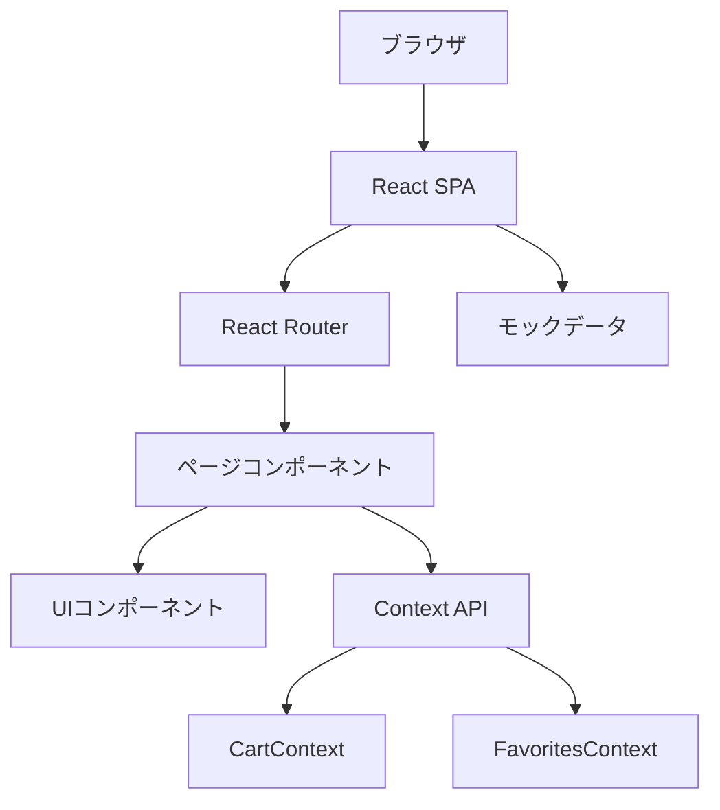
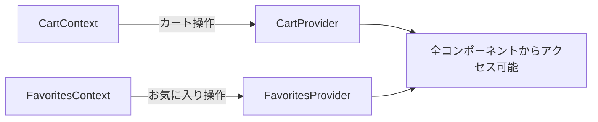
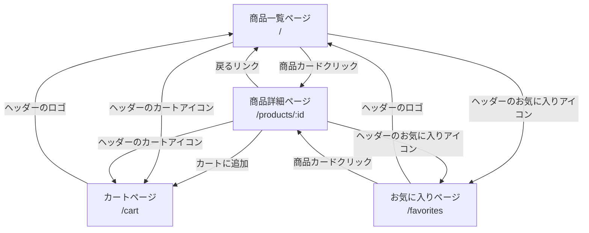
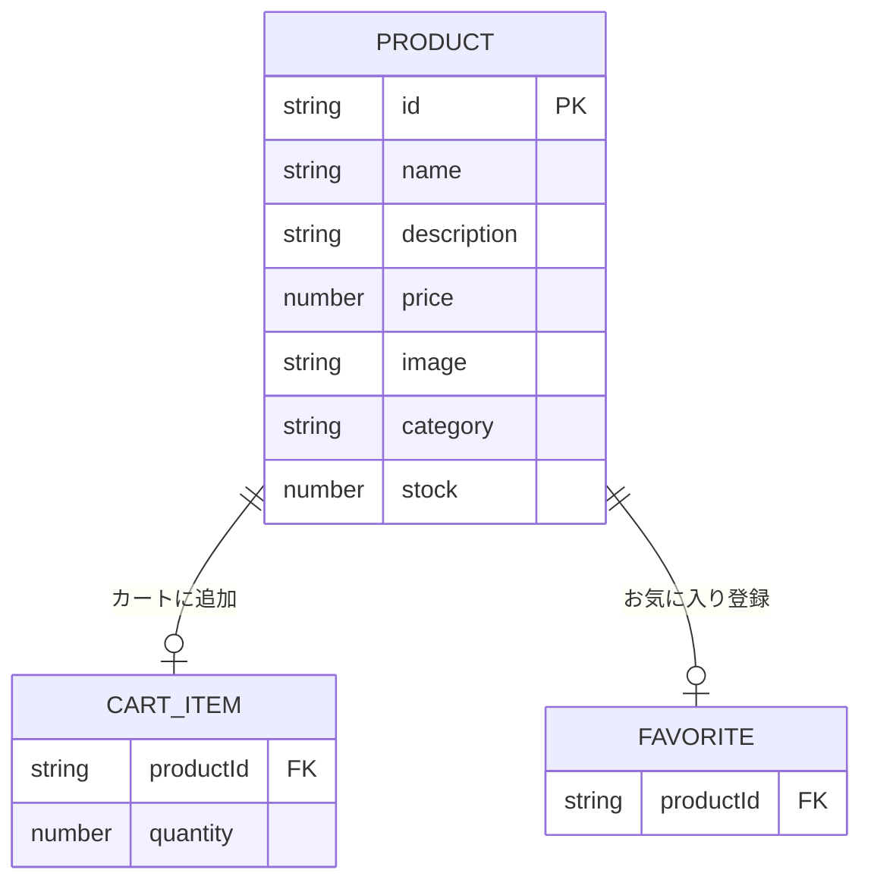
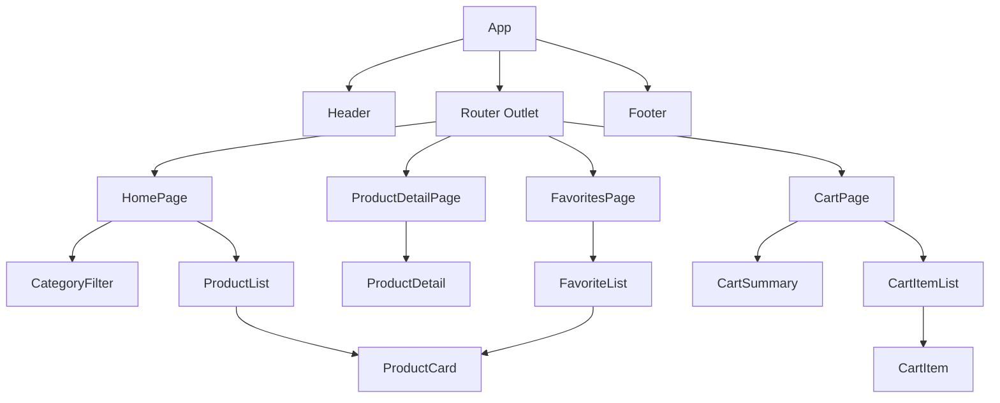
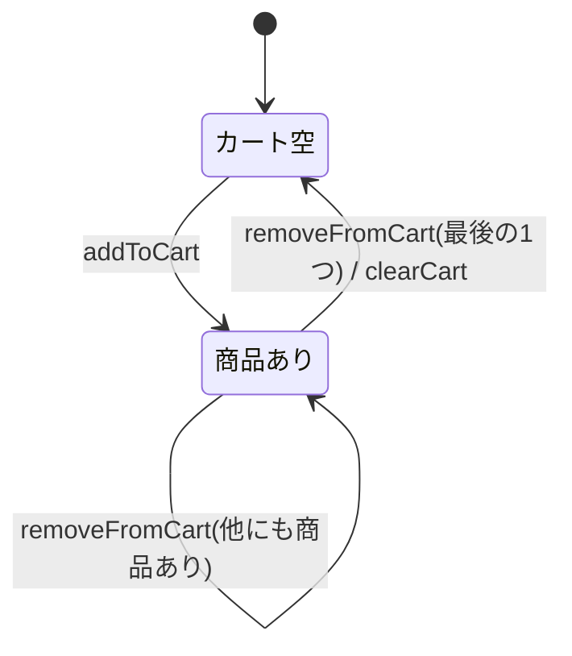

# 機能設計書

## 1. システムアーキテクチャ

### 1.1 全体構成

React SPAとして構築し、クライアントサイドのみで完結する。


```mermaid
graph TD
    A[ブラウザ] --> B[React SPA]
    B --> C[React Router]
    C --> D[ページコンポーネント]
    D --> E[UIコンポーネント]
    D --> F[Context API]
    F --> G[CartContext]
    F --> H[FavoritesContext]
    B --> I[モックデータ]
```

### 1.2 状態管理


```mermaid
graph LR
    A[CartContext] -->|カート操作| B[CartProvider]
    C[FavoritesContext] -->|お気に入り操作| D[FavoritesProvider]
    B --> E[全コンポーネントからアクセス可能]
    D --> E
```

## 2. 画面遷移図


```mermaid
graph TD
    A[商品一覧ページ<br>/] -->|商品カードクリック| B[商品詳細ページ<br>/products/:id]
    B -->|戻るリンク| A
    B -->|カートに追加| C[カートページ<br>/cart]
    A -->|ヘッダーのカートアイコン| C
    A -->|ヘッダーのお気に入りアイコン| D[お気に入りページ<br>/favorites]
    B -->|ヘッダーのカートアイコン| C
    B -->|ヘッダーのお気に入りアイコン| D
    C -->|ヘッダーのロゴ| A
    D -->|ヘッダーのロゴ| A
    D -->|商品カードクリック| B
```

### 2.1 ルーティング定義

| パス | ページ | コンポーネント | 説明 |
|------|--------|----------------|------|
| `/` | 商品一覧 | `HomePage` | トップページ。商品一覧とカテゴリフィルター |
| `/products/:id` | 商品詳細 | `ProductDetailPage` | 商品の詳細情報表示 |
| `/cart` | カート | `CartPage` | カート内商品の一覧と合計 |
| `/favorites` | お気に入り | `FavoritesPage` | お気に入り商品の一覧 |

## 3. データモデル

### 3.1 ER図


```mermaid
erDiagram
    PRODUCT {
        string id PK
        string name
        string description
        number price
        string image
        string category
        number stock
    }
    CART_ITEM {
        string productId FK
        number quantity
    }
    FAVORITE {
        string productId FK
    }
    PRODUCT ||--o| CART_ITEM : "カートに追加"
    PRODUCT ||--o| FAVORITE : "お気に入り登録"
```

### 3.2 TypeScriptインターフェース

```typescript
// 商品カテゴリ
type Category = 'wagashi' | 'yogashi' | 'seasoning' | 'beverage' | 'processed';

// 商品
interface Product {
  id: string;
  name: string;
  description: string;
  price: number;
  image: string;
  category: Category;
  stock: number;
}

// カート内アイテム
interface CartItem {
  product: Product;
  quantity: number;
}

// カテゴリ表示名マッピング
interface CategoryLabel {
  value: Category;
  label: string;
}
```

## 4. コンポーネント設計

### 4.1 コンポーネントツリー


```mermaid
graph TD
    App --> Header
    App --> RouterOutlet[Router Outlet]
    App --> Footer

    RouterOutlet --> HomePage
    RouterOutlet --> ProductDetailPage
    RouterOutlet --> CartPage
    RouterOutlet --> FavoritesPage

    HomePage --> CategoryFilter
    HomePage --> ProductList
    ProductList --> ProductCard

    ProductDetailPage --> ProductDetail

    CartPage --> CartItemList[CartItemList]
    CartItemList --> CartItemComponent[CartItem]
    CartPage --> CartSummary

    FavoritesPage --> FavoriteList
    FavoriteList --> ProductCard
```

### 4.2 コンポーネント一覧

#### レイアウトコンポーネント

| コンポーネント | 責務 | Props |
|----------------|------|-------|
| `Header` | ロゴ、ナビゲーション（カート・お気に入りリンクとバッジ） | なし（Contextから取得） |
| `Footer` | コピーライト表示 | なし |

#### 商品コンポーネント

| コンポーネント | 責務 | Props |
|----------------|------|-------|
| `CategoryFilter` | カテゴリ選択UI | `selectedCategory`, `onSelectCategory` |
| `ProductList` | 商品カードのグリッド表示 | `products` |
| `ProductCard` | 個別商品のカード表示 | `product` |
| `ProductDetail` | 商品詳細情報の表示 | `product` |

#### カートコンポーネント

| コンポーネント | 責務 | Props |
|----------------|------|-------|
| `CartItemList` | カート内商品の一覧 | `items` |
| `CartItem` | カート内個別商品の表示・操作 | `item`, `onUpdateQuantity`, `onRemove` |
| `CartSummary` | 小計・合計金額の表示 | `items` |

#### お気に入りコンポーネント

| コンポーネント | 責務 | Props |
|----------------|------|-------|
| `FavoriteList` | お気に入り商品の一覧（ProductCardを再利用） | `products` |

#### ページコンポーネント

| コンポーネント | 責務 | ルート |
|----------------|------|--------|
| `HomePage` | 商品一覧とカテゴリフィルター | `/` |
| `ProductDetailPage` | 商品詳細の表示。URLパラメータからID取得 | `/products/:id` |
| `CartPage` | カート管理画面 | `/cart` |
| `FavoritesPage` | お気に入り一覧画面 | `/favorites` |

## 5. 状態管理設計

### 5.1 CartContext

```typescript
interface CartContextType {
  items: CartItem[];
  addToCart: (product: Product) => void;
  removeFromCart: (productId: string) => void;
  updateQuantity: (productId: string, quantity: number) => void;
  clearCart: () => void;
  getTotalPrice: () => number;
  getTotalItems: () => number;
}
```

**状態遷移:**


```mermaid
stateDiagram-v2
    [*] --> カート空
    カート空 --> 商品あり : addToCart
    商品あり --> 商品あり : addToCart / updateQuantity
    商品あり --> カート空 : removeFromCart(最後の1つ) / clearCart
    商品あり --> 商品あり : removeFromCart(他にも商品あり)
```

### 5.2 FavoritesContext

```typescript
interface FavoritesContextType {
  favorites: string[];  // productIdの配列
  toggleFavorite: (productId: string) => void;
  isFavorite: (productId: string) => boolean;
  getFavoriteCount: () => number;
}
```

## 6. ワイヤフレーム

### 6.1 商品一覧ページ（`/`）

```
┌──────────────────────────────────────────────┐
│  🛒 おいしいマルシェ        🛒(3)  ♥(2)    │  ← Header
├──────────────────────────────────────────────┤
│                                              │
│  [全て] [和菓子] [洋菓子] [調味料] [飲料]...│  ← CategoryFilter
│                                              │
│  ┌──────────┐ ┌──────────┐ ┌──────────┐    │
│  │  [画像]  │ │  [画像]  │ │  [画像]  │    │
│  │ 商品名   │ │ 商品名   │ │ 商品名   │    │  ← ProductList
│  │ ¥1,200  ♥│ │ ¥800   ♥│ │ ¥2,500  ♥│    │     > ProductCard
│  │ カテゴリ  │ │ カテゴリ  │ │ カテゴリ  │    │
│  └──────────┘ └──────────┘ └──────────┘    │
│                                              │
│  ┌──────────┐ ┌──────────┐ ┌──────────┐    │
│  │  [画像]  │ │  [画像]  │ │  [画像]  │    │
│  │ 商品名   │ │ 商品名   │ │ 商品名   │    │
│  │ ¥950   ♥│ │ ¥1,800  ♥│ │ ¥600   ♥│    │
│  │ カテゴリ  │ │ カテゴリ  │ │ カテゴリ  │    │
│  └──────────┘ └──────────┘ └──────────┘    │
│                                              │
├──────────────────────────────────────────────┤
│  © 2026 おいしいマルシェ                      │  ← Footer
└──────────────────────────────────────────────┘
```

### 6.2 商品詳細ページ（`/products/:id`）

```
┌──────────────────────────────────────────────┐
│  🛒 おいしいマルシェ        🛒(3)  ♥(2)    │
├──────────────────────────────────────────────┤
│                                              │
│  ← 商品一覧に戻る                            │
│                                              │
│  ┌────────────────┐  商品名                  │
│  │                │  ¥1,200                  │
│  │   [商品画像]    │  カテゴリ: 和菓子        │
│  │                │  在庫: あり              │
│  │                │                          │
│  └────────────────┘  商品の説明文がここに     │
│                      入ります。素材や味の     │
│                      特徴を詳しく記載。       │
│                                              │
│  [♥ お気に入りに追加]  [🛒 カートに追加]      │
│                                              │
├──────────────────────────────────────────────┤
│  © 2026 おいしいマルシェ                      │
└──────────────────────────────────────────────┘
```

### 6.3 カートページ（`/cart`）

```
┌──────────────────────────────────────────────┐
│  🛒 おいしいマルシェ        🛒(3)  ♥(2)    │
├──────────────────────────────────────────────┤
│                                              │
│  ショッピングカート                           │
│                                              │
│  ┌──────────────────────────────────────┐    │
│  │ [画像] 商品名A    [-] 2 [+]  ¥2,400 │🗑  │
│  ├──────────────────────────────────────┤    │
│  │ [画像] 商品名B    [-] 1 [+]  ¥800   │🗑  │
│  ├──────────────────────────────────────┤    │
│  │ [画像] 商品名C    [-] 3 [+]  ¥1,800 │🗑  │
│  └──────────────────────────────────────┘    │
│                                              │
│                      小計:     ¥5,000        │
│                      合計:     ¥5,000        │
│                                              │
├──────────────────────────────────────────────┤
│  © 2026 おいしいマルシェ                      │
└──────────────────────────────────────────────┘
```

### 6.4 お気に入りページ（`/favorites`）

```
┌──────────────────────────────────────────────┐
│  🛒 おいしいマルシェ        🛒(3)  ♥(2)    │
├──────────────────────────────────────────────┤
│                                              │
│  お気に入り                                   │
│                                              │
│  ┌──────────┐ ┌──────────┐                  │
│  │  [画像]  │ │  [画像]  │                  │
│  │ 商品名   │ │ 商品名   │                  │
│  │ ¥1,200  ♥│ │ ¥2,500  ♥│                  │
│  │ カテゴリ  │ │ カテゴリ  │                  │
│  └──────────┘ └──────────┘                  │
│                                              │
├──────────────────────────────────────────────┤
│  © 2026 おいしいマルシェ                      │
└──────────────────────────────────────────────┘
```

## 7. スタイリング方針

### 7.1 カラーパレット

| 用途 | カラー | Tailwind クラス |
|------|--------|-----------------|
| プライマリ | アンバー（温かみのある色） | `amber-600` |
| プライマリホバー | アンバー濃 | `amber-700` |
| 背景 | ライトグレー | `gray-50` |
| テキスト | ダークグレー | `gray-800` |
| サブテキスト | ミディアムグレー | `gray-500` |
| ボーダー | ライトグレー | `gray-200` |
| 成功 | グリーン | `green-600` |
| 警告 | レッド | `red-500` |
| お気に入り（活性） | レッド | `red-500` |

### 7.2 レスポンシブブレークポイント

| ブレークポイント | 幅 | 商品カード列数 |
|------------------|-----|----------------|
| モバイル | 〜640px | 1列 |
| タブレット | 641〜1024px | 2列 |
| デスクトップ | 1025px〜 | 3〜4列 |
